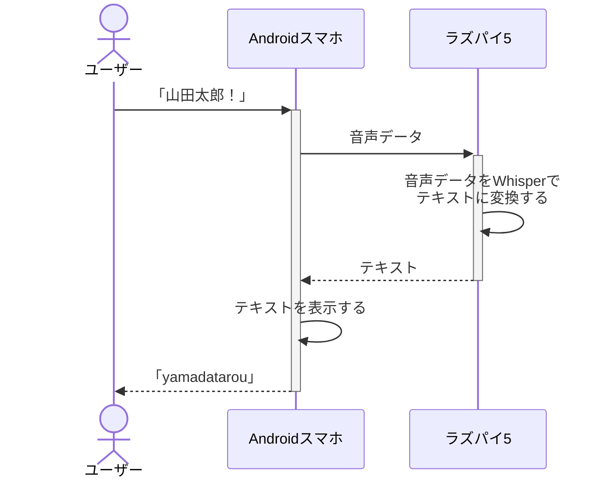
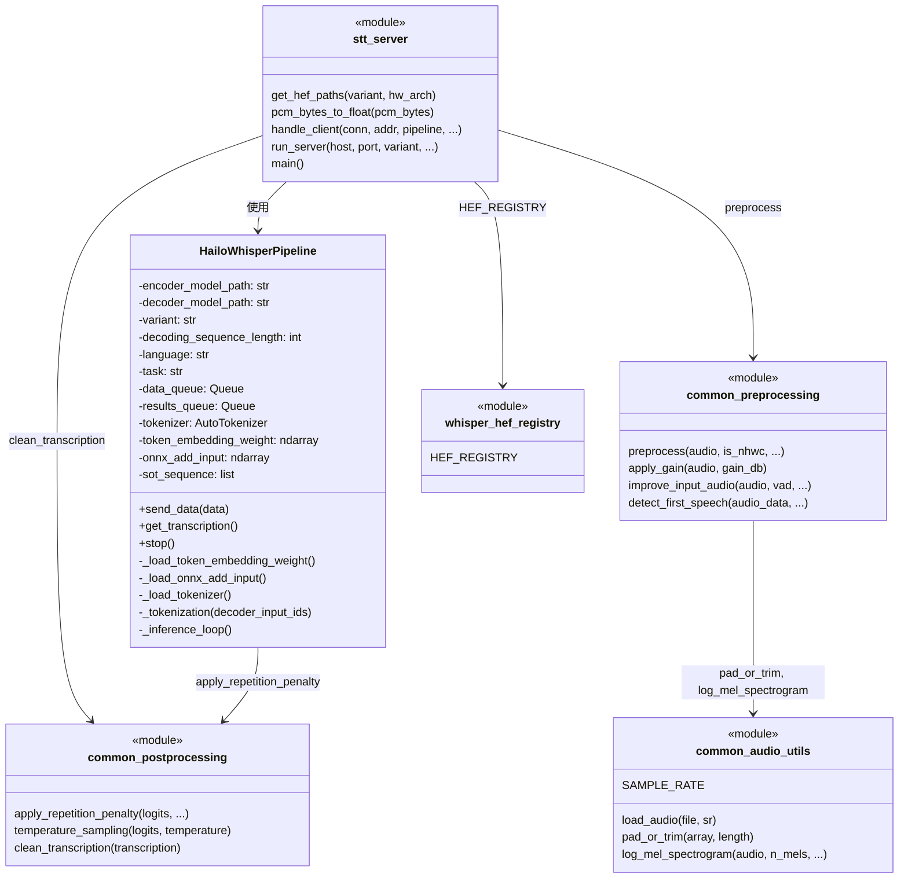
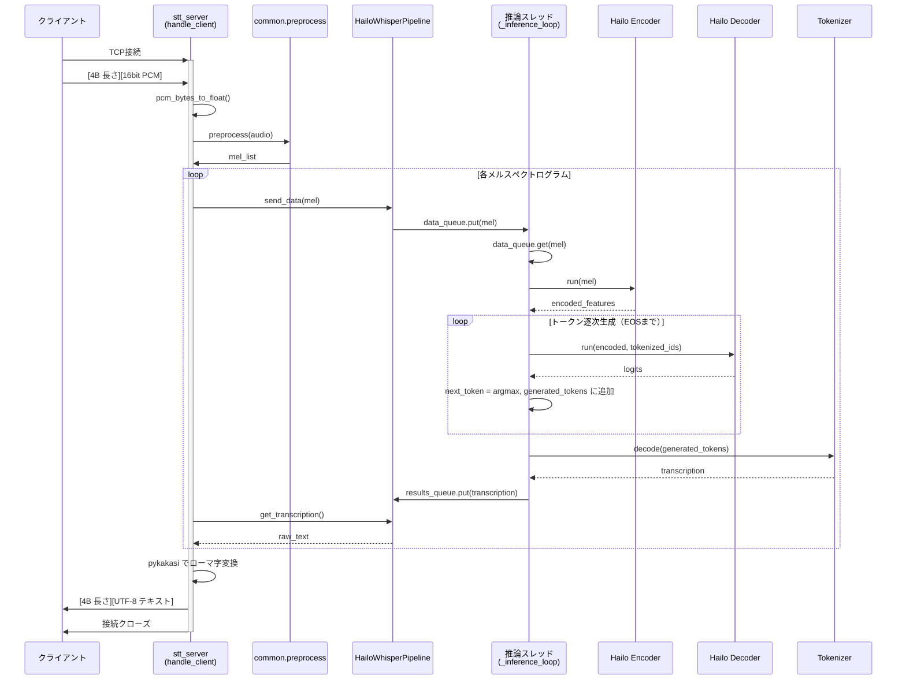
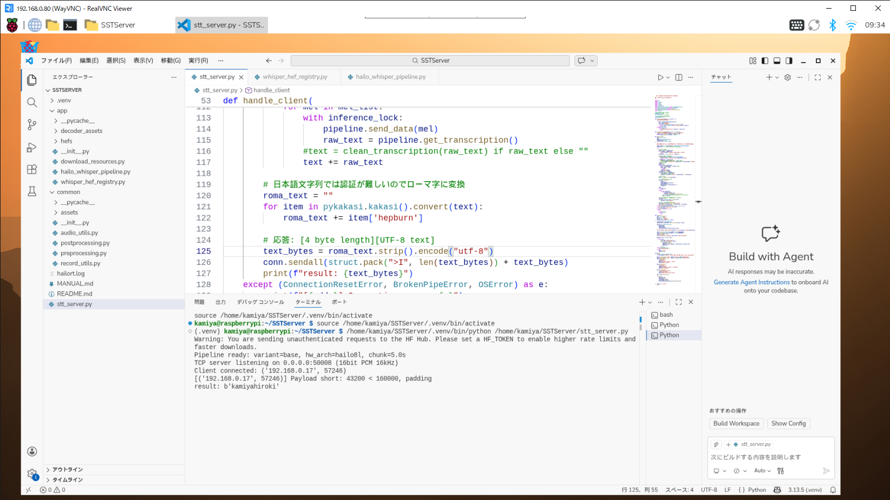
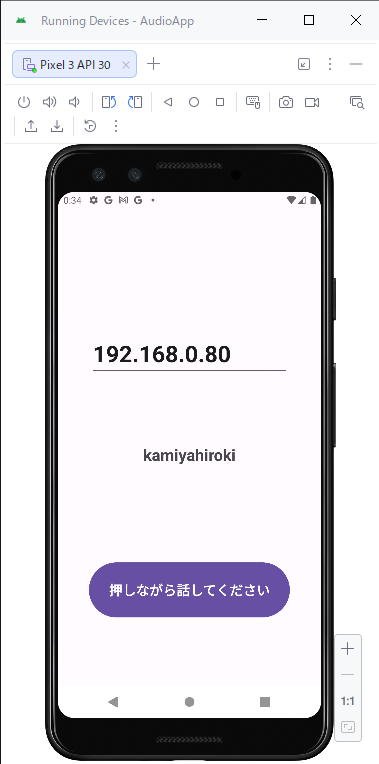

# １概要

## １-１目的

ユーザーが端末マイクに名前を言うだけでユーザーを自動識別したい<br>
今回はAndroidスマホとラズパイで実現する<br>


# ２環境構築

## ２-１ラズパイOSのインストール
https://ushiken.net/raspi5-start-up

## ２-２必要なソフトウェアとドライバのインストール
Python仮想環境を作って必要なモロモロのパッケージと、Hailoを使うためのドライバとランタイムソフトウェアのインストールする手順↓<br>
https://xactico.sharepoint.com/:t:/s/Sol-Eng/IQB_BrGENn7KQorqXeEoIG1yAWNQ7wdN4fdJKhkIq-6esMY?e=MqN9o6

自分のプロジェクトを動かすディレクトリでPython仮想環境を作っておくこと<br>
HailoRTのPCIeドライバとPythonパッケージは以下からダウンロード出来るので掲載しておく<br>
https://hailo.ai/developer-zone/software-downloads/?product=ai_accelerators&device=hailo_8_8l

HailoRT – PCIe driver Ubuntu package (deb)<br>
**hailort-pcie-driver_4.23.0_all.deb**<br>
HailoRT – Python package (whl) for Python 3.13, aarch64<br>
**hailort-4.23.0-cp313-cp313-linux_aarch64.whl**<br>

HailoRTのユーザーガイド<br>
https://hailo.ai/developer-zone/documentation/?product=accelerators&device=hailo_8l&category=sw

## ２-３リモート接続する（任意）
ラズパイ側でVNCを有効にする<br>

PC側でVNC Viewerをインストール<br>
https://apps.microsoft.com/detail/xp99dvcpgktxnj?hl=ja-jp&gl=JP

## ２-４VSCodeを入れる（任意）
```bash
sudo apt install -y code
```

VSCodeを使えばPython仮想環境を自動でactivateしてくれる

# ３ソフトウェア

## ３-１インターフェース
通信プロトコル： **TCP/IP/WLAN**<br>
データ形式：**PCM16bit/モノラル入力/サンプリングレート16KHz**<br>
**※音声認識は16KHzが一般的**<br>

## ３-２ラズパイ側のサーバーの実装（STTServer）

### ３-２-１HailoRTの使い方は以下のプロジェクトを流用
https://github.com/Seeed-Projects/STT_hailo_whisper

このプロジェクトはラズパイに接続されたマイクから入力された音声を認識してテキストをブロードキャストするので、インターフェース部分だけ差し替えてやれば流用出来る<br>

STT_hailo_whisperフォルダ構成<br>
```
app/
    download_resources.py：HEFファイル（パラメータとか入ったバイナリ）のダウンロード
    hailo_whisper_pipeline.py：HailoRTを使って音声認識してる部分
    whisper_hef_registry.py：ダウンロードしたHEFファイルの管理テーブル
common/
    assets/
        mel_filter.npz：STFT結果をメル周波数に変換するための行列
    audio_utils.py：オーディオ関連ユーティリティ
    postprocessing.py：音声認識の後処理
    preprocessing.py：音声認識の前処理（音声認識前にはメルスペクトログラムが必要）
    record_utils.py：録音ユーティリティ（未使用）
test/
    recive_message.py：テスト用のテキスト受信側（未使用）
hailo_whisper.py：大元のメイン処理（未使用）
```
app/とcommon/を流用し、hailo_whisper.pyの代わりにstt_server.pyを新規作成する<br>

### ３-２-２必要なパッケージをインストールする
requirements.txtで一括インストール出来るが、今回不要なパッケージもあるので追加で必要なものだけ掲載する<br>

```bash
pip install transformers
pip install torch
pip install scipy
pip install pykakasi
```
### ３-２-３クラス図



### ３-２-４シーケンス図



### ３-２-５未出力や誤認識が頻繁に発生する問題
音声認識の結果が空テキストであったり全然違うテキストを出力したりで、正解率が10%未満だった<br>
ところが英文を喋ると精度が高く、また日本語で **”今日の天気は雨です”** と話すと **”Today's weather is rainy.”** と正しく翻訳されてしまう<br>
結果から推測すると、日本語として認識はしているが英訳していることになる<br>
英文として意味をなさない日本語名は翻訳出来ずに空テキストになってしまうことも納得出来る<br>
デバッガで確認したところ、結果が空テキストの場合でも最後のTokenizerによるdecode直前までは複数トークンが出力されてるので、Tokenizerで英文翻訳を行わないよう変更した<br>

トークンIDがどのような働きをしているのかまだ理解出来てないが、タスクや言語を指定できるらしいので翻訳なし（文字起こしのみ）＆日本語をAIにコード出力させた結果<br>

hailo_whisper_pipeline.py：
``` python
def _load_tokenizer(self):
    ・・・
    self.tokenizer = AutoTokenizer.from_pretrained(f"openai/whisper-{self.variant}")
    （以下を追加）
    start_id = self.tokenizer.convert_tokens_to_ids("<|startoftranscript|>")
    lang_id = self.tokenizer.convert_tokens_to_ids(f"<|{self.language}|>")
    task_id = self.tokenizer.convert_tokens_to_ids("<|transcribe|>" if self.task == "transcribe" else "<|translate|>")
    if start_id is None or (lang_id is None or lang_id == self.tokenizer.unk_token_id) or task_id is None:
        # Fallback: known IDs for openai/whisper-* (50258, ja=50266, transcribe=50364, translate=50363)
        start_id = 50258
        if self.language == "ja":
            lang_id = 50266
        elif self.language == "en":
            lang_id = 50259
        else:
            lang_id = 50259  # fallback to en if unknown
        task_id = 50364 if self.task == "transcribe" else 50363
    self.sot_sequence = [start_id, lang_id, task_id]
```
```python
def _inference_loop(self):
    ・・・
    （sot_sequenceの追加に合わせて以下を変更）
# Decoder initialization: <|startoftranscript|><|lang|><|transcribe|> so that
# the model transcribes in the chosen language instead of translating to English.
num_prompt_tokens = len(self.sot_sequence)
decoder_input_ids = np.zeros((1, self.decoding_sequence_length), dtype=np.int64)
decoder_input_ids[0, :num_prompt_tokens] = self.sot_sequence
```

## ３-３Androidアプリの実装（AudioApp）

ボタンを押している間マイクから入力した音声をバッファリングし、ボタンを離すとバッファリングしたデータをラズパイへ送信して、受信したテキストを画面に表示するアプリを作成<br>
AndroidStudioで空プロジェクトだけ作ったらほぼAIだけで作れるので詳細は省く<br>

ソースコード：<br>
**AudioApp/app/src/main/java/com/example/audioapp/MainActivity.java**<br>

# ４使い方

## ４-１HEFファイルをダウンロードする（初回のみ）
```bash
python3 download_resources.py
```

ダウンロードしたHEFファイルはapp/hefsに保存される<br>
**Hailo8/8l/10においてtiny/tiny.en/baseモデルを全てダウンロードして時間がかかるので、Hailo8lのみに変更したほうが良い**<br>

## ４-２STT_Serverを起動
```bash
python3 stt_server.py
```

以下の引数で指定出来るが特にデフォルトのままでOK
```
--host バインドするアドレス（defaultは0.0.0.0）
--port バインドするポート（defaultは50008）
--variant モデル指定 tiny/tiny.en/base（defaultはbase）
--hw-arch ハード種別 hailo8/hailo8l/hailo10h(※1)
--multi-process-service マルチプロセスで処理(※2)
```
**※1.defaultはhailo8lで変更不可**<br>
**※2.実際やってみたら例外吐いたがシングルモードでも要件は満たせるので未調査**<br>



## ４-３Androidアプリを起動
ボタンを押しながら名前を言うと画面にローマ字で表示される<br>



# ５まとめ

## ５-１精度と処理速度
tinyとbaseそれぞれで正解率と処理速度を測定する予定<br>

実際に使ってみた感じではtinyとbaseで遜色ない<br>
むしろ通信スループットのほうがボトルネックになりそう<br>

## ５-２課題
### ５-２-１その時々の状況に応じて誤認識が発生する
寒くて活舌が悪いと次のような結果になる<br>
**「かみやひろき」→”kamiyahiroki” 〇**<br>
**「かみやひろき」→”kamiwohiroki” ✕**<br>

### ５-２-２漢字トークンの読み間違いが発生する
たとえば日本語トークン **「山」「だ」「たろう」** が出力された場合、そこからカタカナに変換する時に **「山」** を音読み変換してしまう<br>
**「山田太郎」→”sandatarou”**<br>

### ５-２-３意味を関連付けしようとする
Whisperは文章を音声認識するので単語レベルでのトークン分けを行う<br>
もっと細かい文字レベルで認識すれば名前の音声認識という目的では精度が上がるはず<br>

### ５-２-４名前は同姓同名の人がいるので識別に使えない
顔認証や生体認証が望ましいが、音声認識で実現するなら社員番号等のユニークな識別子を使うべき<br>
